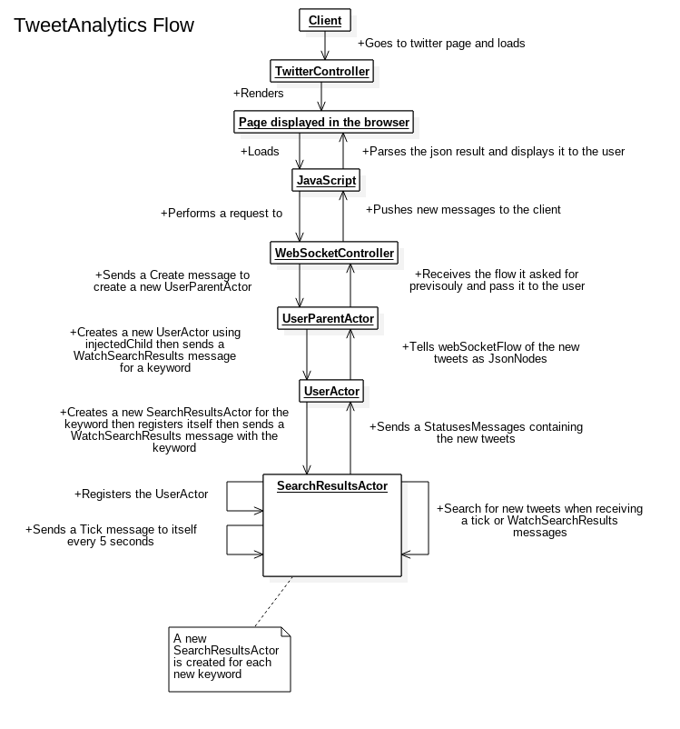

# TweetAnalytics

SOEN6441 Assignment 2. Now Tweet search is reactive!

## Running

Run this using [sbt](http://www.scala-sbt.org/).  

```
sbt run
```

And then go to http://localhost:9000 to see the running web application.

```
sbt jacoco
```

Computes the coverage.

```
sbt doc
```

Generates the JavaDoc.

## Team Members


| Name                      | Student ID    | Contributions                        |
| :-----------------------: |:-------------:| :-----------------------------------:|
| Adrien Poupa              | 40059458      | TwitterController, Models, JavaDoc   |
| Jialu Wang                | 40019673      | Framework architecture, Twitter API  |
| Wei Li                    | 40027433      | Junit tests, JavaDoc, UI             |
| Vamsikrishna Tamil Selvan | 40010750      | Test cases, JavaDoc, Documentation   |
| Manoj Kumar Muppavarapu   | 40042560      | JavaDoc, Test cases, Documentation   |

## Application flow



## Controllers

- WebSocketController.java:

  Handles the WebSocket

- HomeController.java:

  Displays the homepage

- TwitterController.java:

  Handles the search and profile pages

## Models

- SearchResult.java:

  Handles the JSON object returned by Twitter's search API.
  
- Status.java:

  Handles the status included in both Search and Profile.
  
- User.java:

  Handles the user included in both Search and Profile.

## Actors

- GuiceInjectedActor.java:

  Used to create actors that use Guice's Inject annotation.

- Messages.java:

  All the messages sent/received by the actors.

- SearchResultsActor.java:

  Search actor, calls the TwitterImplementation.

- UserActor.java:

  Handles and supervises the SearchResultsActors

- UserParentActor.java:

  Creates and supervises the UserActor.

## Services

- TwitterAPI.java:

  Interface that defines the implementations.

- TwitterImplementation.java:

  Uses the results provided by the TwitterService to parse the tweets.

- TwitterService.java:

  Calls the live TwitterAPI, implements the TwitterAPI interface.